# **Final SDD_LAB - งานเดี่ยว**

## Step1

ทำเป็นไฟล์ MD แทน เพื่อนำไป push ขึ้น github

## Step2

ให้ทำการ download ไฟล์ final-lab-2-2566-engce112.zip จากที่นี่ 

https://drive.google.com/file/d/1C3pWCGooDBRikpwLDHoRM4Ej2Q6caDRt/view?usp=sharing

ให้ทำการแตก zip จะได้ 2 directory ดังนี้

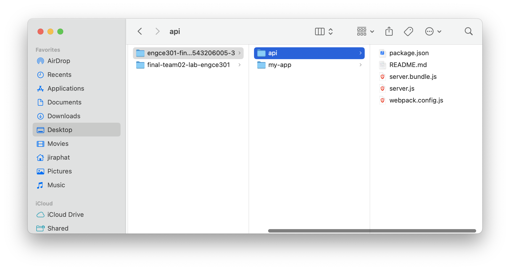

ให้เข้าไปติดตั้ง node modules ทั้ง 2 directory ด้วยคำสั่ง

`api`

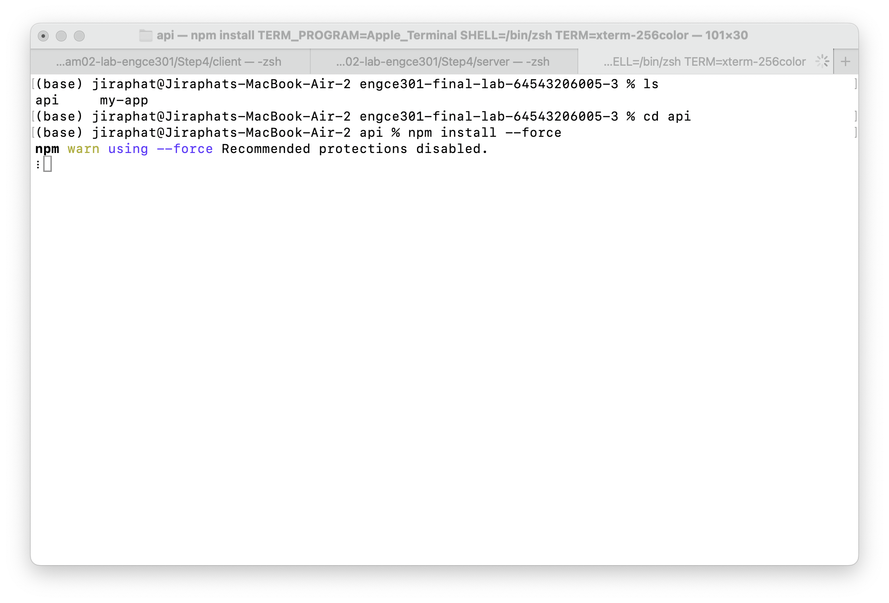

`my-app`

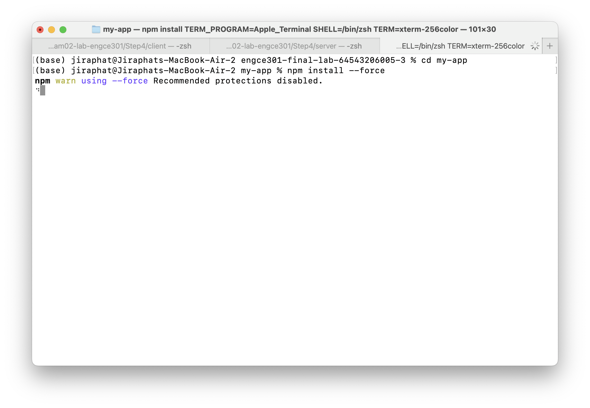

## Step3

ให้ทำการ run application ใน directory ชื่อ api `npm start`

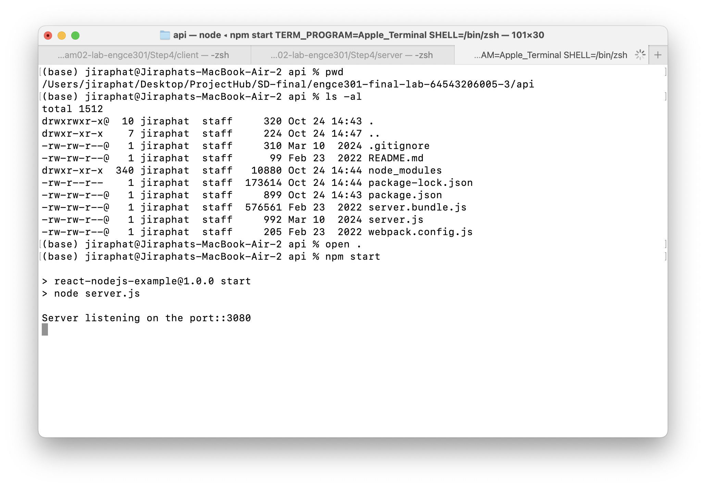

## Step4

ให้ทำการ run application ใน directory ชื่อ my-app `npm start`

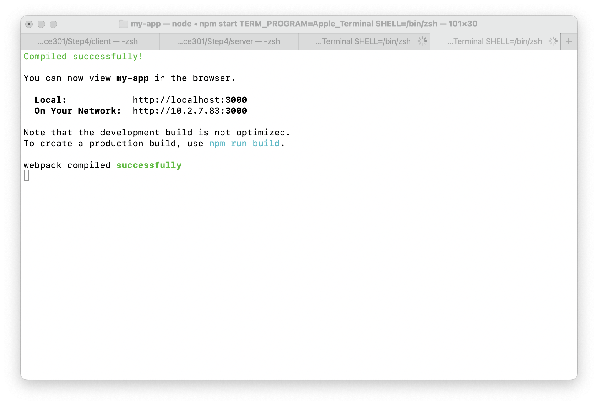

## Step5

ปรับโปรแกรมให้แสดงผล เป็นสมาชิกของทีม ชื่อ (Name) , นามสกุล (Lastname ) และ Email ของตัวเอง (Email ของมหาวิทยาลัย) **และให้เพิ่มคอลัมน์ ตำแหน่ง (Position) โดยแสดงผลต่อจาก Email

`api/server.js`

```javascript
const express = require('express');
const path = require('path');
const app = express();
const bodyParser = require("body-parser");
const port = 3080;

// place holder for the data
const users = [
  {
    firstName: "Jiraphat",
    lastName: "Jamprasert",
    email: "jiraphat_ja64@live.rmutl.ac.th",
    position: "Student"
  },
  {
    firstName: "Teerapat",
    lastName: "Chomchoey",
    email: "teerapat_ch65@live.rmut.ac.th",
    position: "Student"
  },
  {
    firstName: "Jittapong",
    lastName: "Jongjai",
    email: "jittapong_jo65@live.rmutl.ac.th",
    position: "Student"
  }
];

app.use(bodyParser.json());
app.use(express.static(path.join(__dirname, '../my-app/build')));

app.get('/api/users', (req, res) => {
  console.log('api/users called!')
  res.json(users);
});

app.post('/api/user', (req, res) => {
  const user = req.body.user;
  console.log('Adding user:::::', user);
  users.push(user);
  res.json("user addedd");
});

app.get('/', (req,res) => {
  res.sendFile(path.join(__dirname, '../my-app/build/index.html'));
});

app.listen(port, () => {
    console.log(`Server listening on the port::${port}`);
});
```

`my-app/src/components/Users.js`

```javascript
import React from 'react'

export const Users = ({users}) => {

    console.log('users length:::', users.length)
    if (users.length === 0) return null

    const UserRow = (user,index) => {

        return(
              <tr key = {index} className={index%2 === 0?'odd':'even'}>
                  <td>{index + 1}</td>
                  <td>{user.firstName}</td>
                  <td>{user.lastName}</td>
                  <td>{user.email}</td>
                  <td>{user.position}</td>
              </tr>
          )
    }

    const userTable = users.map((user,index) => UserRow(user,index))

    return(
        <div className="container">
            <h2>Users</h2>
            <table className="table table-bordered">
                <thead>
                <tr>
                    <th>User Id</th>
                    <th>Firstname</th>
                    <th>Lastname</th>
                    <th>Email</th>
                    <th>Position</th>
                </tr>
                </thead>
                <tbody>
                    {userTable}
                </tbody>
            </table>
        </div>
    )
}
```

**result**

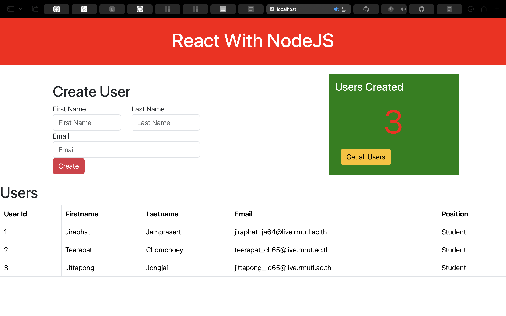

## Step6

ไปที่ github ของตัวเองและทำการสร้าง repository ใหม่ ชื่อว่า  `engce301-final-lab-64543206005-3`

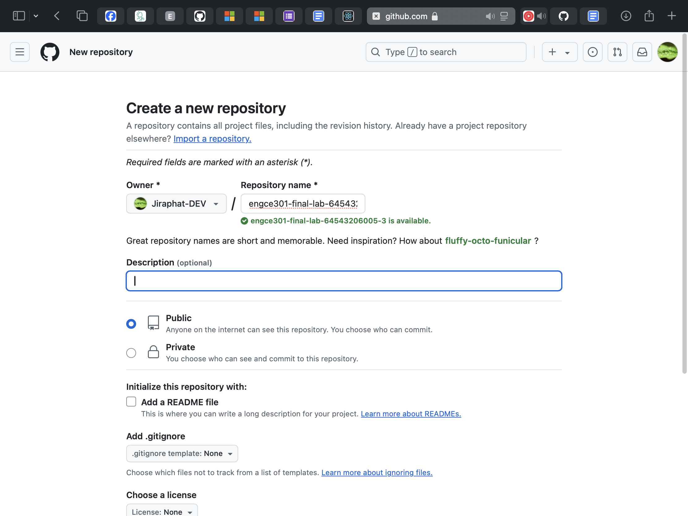

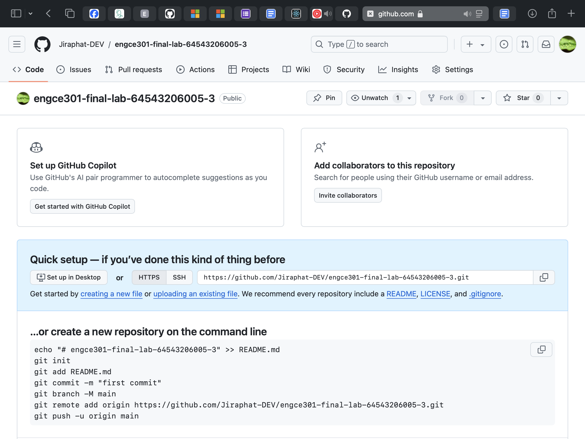

## Step7

ในเครื่องตัวเองให้เข้าไปที่ directory ชื่อ `engce301-final-lab-64543206005-3` ที่ทำงานมาตั้งแต่ STEP1-5 และใช้คำสั่ง `git init `

เพื่อสร้างข้อมูล git ของ directory ปัจจุบัน จากนั้นทำการเอาข้อมูลงานทั้งหมดใน directory ชื่อ `engce301-final-lab-64543206005-3` ขึ้น git repository ของตัวเองที่สร้างขึ้น

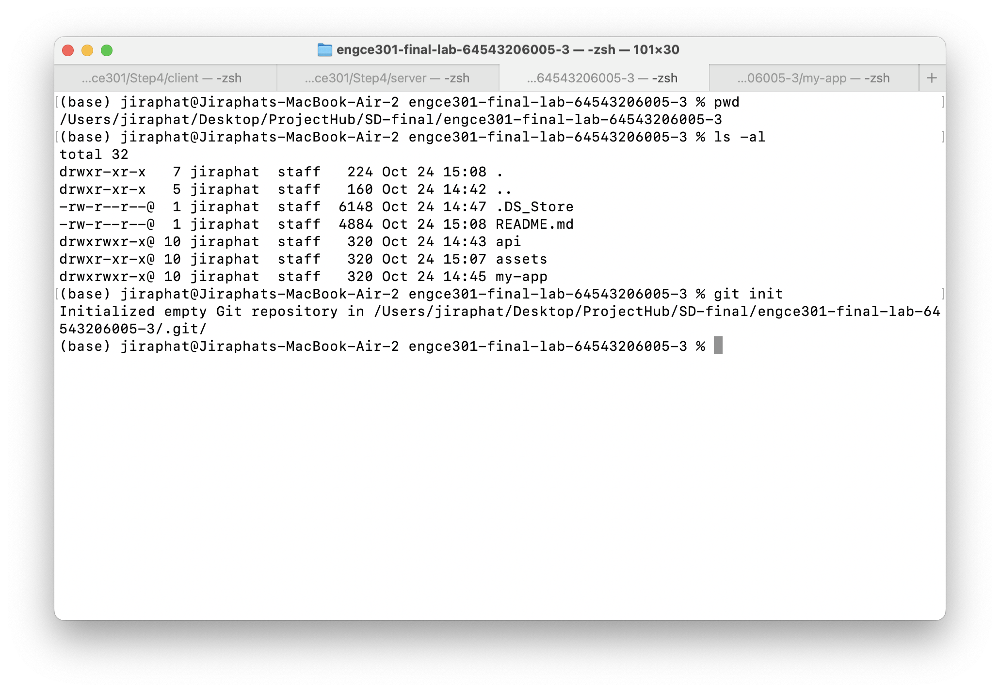

`git add .`, `git commit -m 'first commit'`

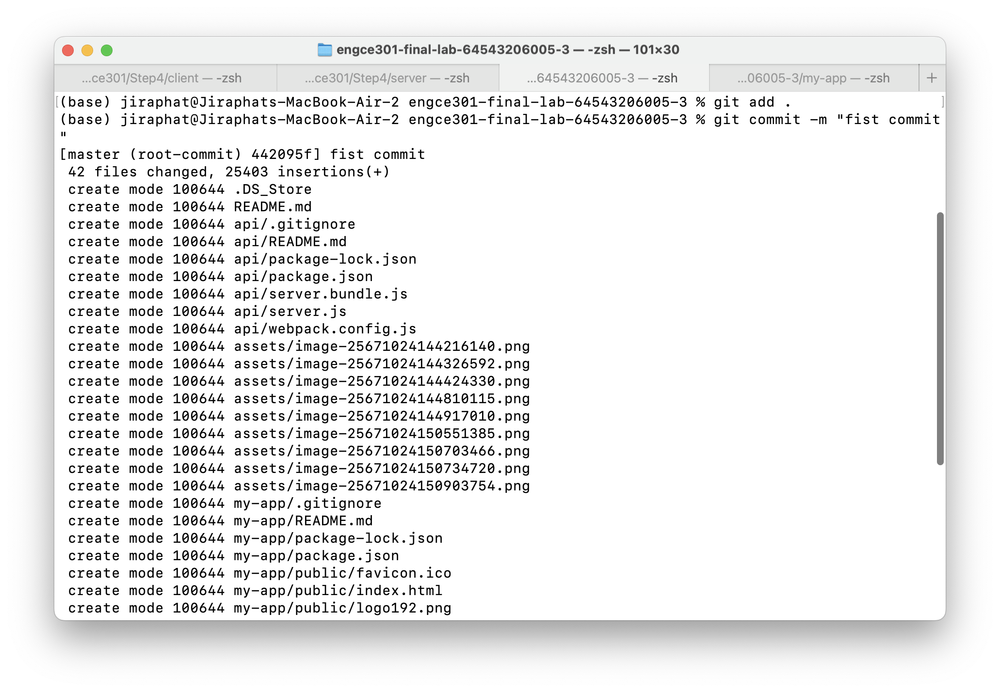

`git remote add origin https://github.com/Jiraphat-DEV/engce301-final-lab-64543206005-3.git`

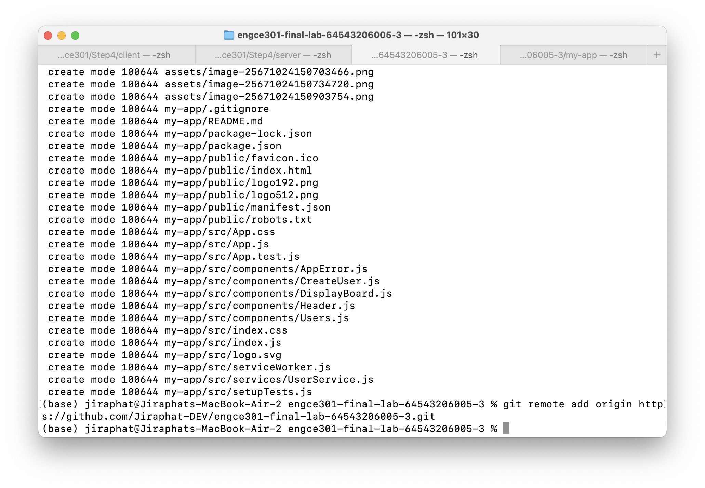

`git branch -M main`

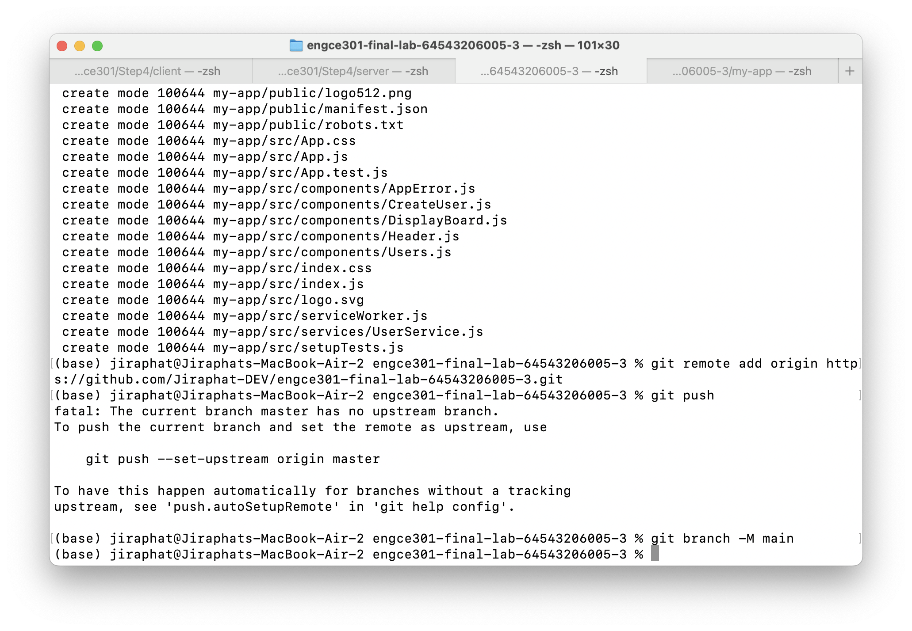

`git push -u origin main`

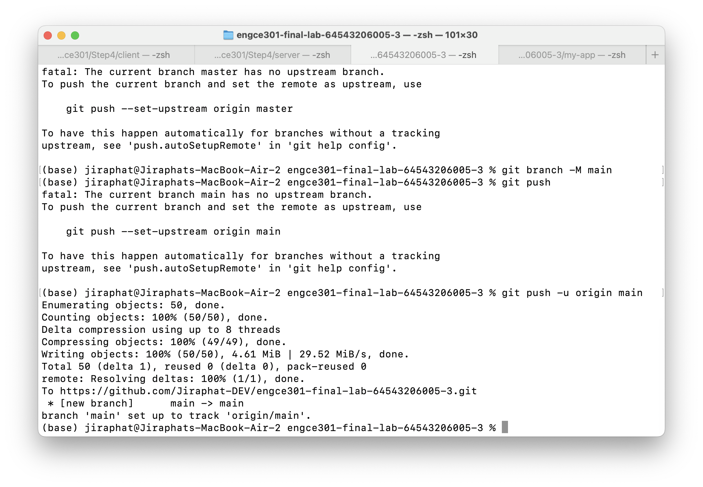

## Step8

เมื่อทำเสร็จแล้วให้ป้อน git url ของงานที่นี่

```
https://github.com/Jiraphat-DEV/engce301-final-lab-64543206005-3.git
```

## Step9

ให้ download เอกสารนี้พร้อมเอกสารอธิบายและภาพระหว่างการทำงาน/ผลการทำงานเป็น pdf

และส่งใน direct message ของ slack